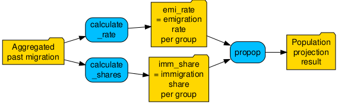

```{r, include = FALSE}
knitr::opts_chunk$set(
  collapse = TRUE,
  comment = "#>"
)
```

<div style="border: 2px solid #f0c36d; background: linear-gradient(135deg, #fff8e6, #fffdf4); color: #7a5a00; padding: 16px 20px; border-radius: 12px; font-weight: 700; font-family: sans-serif; text-align: center; box-shadow: 0 2px 8px rgba(0,0,0,0.08);">
  ⚠️ Work in progress
</div>


```{r setup, message = FALSE, warning=FALSE}
library(propop)
```

# Overview

This vignette explains how to use `propop::propop()` to perform population 
projections for multiple regions and particularly for subregions within a larger
spatial entity (e.g., municipalities or districts within a canton). 
It discusses two **challenges** that arise when conducting such projections and 
presents potential strategies for addressing them:  

1. Obtain the **required input data** for spatial entities below 
the level of cantons  (section ` Projection parameters for subregions`).
2. Account for **migration between subregions** (section `Migration between subregions`). 

For more background and general information about the required input data, see 
[this vignette](project_single_region.html)). 

# Projection parameters for subregions

Numeric information about demographic processes such as births, migration, or 
deaths are an essential prerequisite for population projections. However, in 
Switzerland this information is typically only available for cantons but not 
for spatial entities at smaller scales. 

Supplying input data for spatial units at the sub-cantonal level (e.g. 
municipalities) can be straightforward for data expressed as rates (e.g. 
mortality rate): The simplest approach is to use the same figures for the 
subregions as for the canton (unless the figures are implausible for 
theoretical or empirical reasons). 

The task is more demanding, though, if you want to **alter rates** for subregions or 
when you need to downscale input data expressed as **"number of people"**.   

- To adjust the cantonal "number of people" estimates among subregions, check the 
next two subsections.  
- If you want to adjust birth rates, you may find the dedicated package [`propopbirth`](https://github.com/statistik-aargau/propopbirth) useful.   
- For adjusting other rates, the procedure described in section `Migration between subregions` could be useful.  

## Distribution of people according to population size

A very simple approach to allocate canton-wide "number of people" estimates to 
subregions is to determine each subregion's population size relative to the 
canton's total population and distribute the numbers accordingly. To put it 
somewhat simplistically, if a municipality represents 10% of the canton's 
population, it should proportionally receive 10% of the canton's incoming 
migrants. The approach described below is more sophisticated in that it uses 
the spatial units' shares per demographic group but the core idea is the same.

Let's look at a concrete, numeric example. For the sake of simplicity, we use 
the data included in the package to create small, fictitious input data with 
five regions:


**Input parameters** (after this step, the rates and numbers for the 
subregions are still identical to those for the whole canton): 

```{r data-parameters} 
# FSO parameters for fictitious subregions
fso_parameters_sub <- fso_parameters |>
  dplyr::filter(scen == "reference") |>
  # duplicating rows 5 times
  tidyr::uncount(5) |>
  # create 5 subregions
  dplyr::mutate(spatial_unit = rep(1:5, times = nrow(fso_parameters |>
                                                       dplyr::filter(
                                                         scen == "reference"
                                                       )))) |>
  dplyr::mutate(spatial_unit = as.character(spatial_unit))
```

**Population** data: 

```{r data-population}
# Generate 5 random "cuts" to distribute the original population;
# use range 0.1-0.5 to avoid very small or very large regions
cut_1 <- {
  set.seed(1)
  round(runif(1, min = 0.1, max = 0.5), digits = 2)
}
cut_2 <- {
  set.seed(2)
  round(runif(1, min = 0.1, max = 0.5), digits = 2)
}
cut_3 <- {
  set.seed(3)
  round(runif(1, min = 0.1, max = 0.5), digits = 2)
}
cut_4 <- {
  set.seed(4)
  round(runif(1, min = 0.1, max = 0.5), digits = 2)
}
# Create last cut so that everything adds up to 100%
cut_5 <- 1 - cut_1 - cut_2 - cut_3 - cut_4

# Generate population data for five subregions
df_population <- fso_population |>
  # duplicating rows 5 times
  tidyr::uncount(5) |>
  # create 5 subregions
  dplyr::mutate(
    spatial_unit = as.character(rep(1:5, times = nrow(fso_population)))
  ) |>
  dplyr::mutate(
    # Distribute original population according to "cuts"
    n = dplyr::case_match(
      spatial_unit,
      "1" ~ round(n * cut_1),
      "2" ~ round(n * cut_2),
      "3" ~ round(n * cut_3),
      "4" ~ round(n * cut_4),
      "5" ~ round(n * cut_5),
      .default = NA
    ),
    .keep = "all"
  )
```

To calculate the shares, we count the number of people in each demographic group 
across all spatial units (`sum_n`). Next, the `share` is obtained by dividing 
the spatial unit's `n` by the sum of all people across all spatial units in the
respective demographic group (`sum_n`). Note that the sum of all five region's 
shares is 1 (e.g., 0.21 + 0.17 + 0.17 + 0.33 + 0.12 = 
`r 0.21 + 0.17 + 0.17 + 0.33 + 0.12`).

```{r shares-pop-size}
# Calculate shares
df_population_shares <- df_population |>
  dplyr::mutate(sum_n = sum(n), .by = c(nat, sex, age)) |>
  dplyr::mutate(share = n / sum_n)

# Display table
df_population_shares |>
  dplyr::mutate(share = round(share, 3)) |>
  DT::datatable() |>
  DT::formatStyle(c("share"),
                  backgroundColor = DT::styleRow(c(1:5), "#96D4FF", default = "")
  )
```
\ 

Now all required data are available and we can distribute the input variables
expressed as "number of people" among subregions. 

Let's do this with immigration from other countries (`imm_int_n`) and immigration 
from other cantons (`imm_nat_n`). We first join the data frame containing the 
projection parameters (`fso_parameters_sub`) and the data frame containing the 
shares (`df_population_shares`). Identifiers for demographic groups must be 
present in both data frames. The actual distribution involves only a single line 
per parameter in which the canton-wide number of immigrants (`imm_int_n` and 
`imm_nat_n`) is multiplied by the share (`share`), which in this approach is
identical for both types of immigration.

```{r distribute-pop-size}
parameters_sub_size <- fso_parameters_sub |>
  dplyr::left_join(
    df_population_shares |>
      dplyr::select("spatial_unit", "nat", "sex", "age", "share"),
    by = c("spatial_unit", "nat", "sex", "age")
  ) |>
  dplyr::mutate(
    # Calculate number of incoming people per demographic group and spatial unit
    imm_int_n_distr = imm_int_n * share,
    imm_nat_n_distr = imm_nat_n * share
  )
```

Let's take a closer look at the result of this, focusing on immigration from 
other countries. In the table below, the blue columns `check` and `difference` 
show that the sum of the distributed parameter (`imm_int_n_distr`) adds up to the 
total number of people (`imm_int_n`; i.e., the original figures provided by 
the FSO for the whole canton). 

```{r distr-pop-size-check}
parameters_sub_size |>
  dplyr::mutate(
    check = round(sum(imm_int_n_distr), 0),
    .by = c(scen, year, nat, sex, age)
  ) |>
  dplyr::filter(sex == "m" & nat == "int") |>
  dplyr::mutate(across(c(
    "int_mothers":"emi_nat", "acq", "share":"imm_nat_n_distr"
  ), \(x) round(x, 3))) |>
  dplyr::mutate(difference = imm_int_n - check) |>
  dplyr::select(-scen) |>
  # Only use selection of years to save space
  dplyr::filter(year < 2027) |>
  DT::datatable() |>
  DT::formatStyle(
    "imm_int_n",
    backgroundColor = "#ffcc8f"
  ) |>
  DT::formatStyle(
    c("check", "difference"),
    backgroundColor = "#96D4FF"
  )
```
\
To proceed with the projection, the columns with the distributed immigration 
(`imm_int_n_distr` and `imm_nat_n_distr`) need to become the new 
`imm_int_n` and `imm_nat_n`. Otherwise, `propop()` won't recognize the parameters.  

``` {r cleaning}
parameters_sub_size_clean <- parameters_sub_size |>
  dplyr::mutate(
    # Rename variables
    imm_int_n = imm_int_n_distr,
    imm_nat_n = imm_nat_n_distr
  ) |>
  dplyr::select(-share, -imm_int_n_distr)
```

Now we can run the projection:

```{r project-1}
propop(
  parameters = parameters_sub_size_clean,
  year_first = 2025,
  year_last = 2026,
  scenarios = "reference",
  age_groups = 101,
  fert_first = 16,
  fert_last = 50,
  share_born_female = 100 / 205,
  population = df_population,
  binational = TRUE,
  subregional = FALSE
)
```


## Distribution of people according to past migration

The second approach to distribute "number of people" estimates among subregions 
uses historical migration records. An advantage of this approach is that it can
differentiate between different types of migration (or any number-of-people 
input) and thereby enables adjusting each parameter independently (rather than 
using the same share for adapting all parameters). This is great, for example, if 
*immigration from other cantons* differs from *immigration from other countries*.

To illustrate this approach, we use international immigration as an example and 
create a fictitious data frame with five regions. For pedagogical reasons, we 
modify the data a little bit. Spatial unit 1 won't have any international 
immigration among children aged 0-4 years. Consequently, the value in the column 
`hist_imm_int` contains zeros for these entries. This doesn't reflect realistic 
conditions but helps to illustrate the suggested procedure in cases where zero 
observations exist for demographic groups.

> With *real data,* the same can be achieved by summarizing the 
historical migration data. Since real migration usually varies from 
year to year, we advise calculating an average across several years. 
The fictitious data assumes that we have already performed this step. 


```{r data}
set.seed(145)

# Immigration records
df_hist_imm <- tibble::tibble(
  # five fictitious spatial units
  spatial_unit = rep(c("1", "2", "3", "4", "5"), each = 101 * 4),
  # two nationalities
  nat = rep(rep(c("ch", "int"), each = 2 * 101), times = 5),
  # two levels for sex
  sex = rep(rep(c("m", "f"), each = 101), times = 5 * 2),
  # age groups from 0 to 100
  age = rep(0:100, times = 5 * 4)
) |>
  dplyr::mutate(
    # random numbers between zero and 50 are created to mimic historical
    # immigration records observed in Aargau
    hist_imm_nat = sample(0:50, dplyr::n(), replace = TRUE),
    hist_imm_int = sample(0:50, dplyr::n(), replace = TRUE),
    # for one spatial unit, we artificially assign zeros to all children
    # between 0-4 years
    hist_imm_int = ifelse(
      spatial_unit == 1 & age %in% c(0:4), 0, hist_imm_int
    )
  )
```

The resulting data frame includes two columns with (fictitious) immigration 
from abroad (` hist_imm_nat`) and from other cantons (`hist_imm_nat`), aggregated
per demographic group:

```{r data-historical-immigration}
df_hist_imm |>
  DT::datatable()
```

\ 

A challenge is that records often vary considerably between years. If the 
patterns are too uneven, future trends may become erratic, especially in 
groups with few people (e.g., small municipalities or small age groups). 

A first step to mitigate this issue should already have happened at this stage, 
namely considering several years and using the arithmetic mean as an estimate
of each demographic group's past migration.

`propop::calculate_shares()` offers an additional remedy. Instead of only using
shares based on 1-year age groups, it is possible to resort to 5-year and 10-year 
age groups, which further smooths out irregular patterns. 

To use this function, you need to provide a data frame containing a column with
the number of immigrants per demographic group (e.g., `hist_imm_nat` or 
`hist_imm_int` as calculated above). The function assigns each 1-year
age group to a 5-year and a 10-year age group (e.g., 2-year olds become part of 
the age_groups 0-4 and 0-9) and sums up all observations within the respective 
5-year and 10-year age group (e.g., all 0-4 and 0-9 year old Swiss males). These 
sums (`sum_5`and `sum_10` in the table below) are then divided by five or ten, 
respectively, and equally assigned to each "member" of the age group 
(`prop_5` and `prop_10` in the table below). 

To **distribute the canton-wide numbers** among subregions, 
`propop::calculate_shares()` uses the 1-year age group if its mean share is 
larger than zero. If no immigration was recorded for a particular 1-year age 
group (e.g., the 76-year old Swiss males in spatial unit 1), the mean share of 
the corresponding 5-year age group is used (i.e., 75-79-year old Swiss males 
in the case of 76-year old). If the share across the 5-year age group is also 
zero, the 10-year age group is used (this could be 70-79 year old Swiss males). 
In this case, the `prop_10` share of the respective 10-year age group is used for 
both 5-year age groups within the 10-year age group (e.g., the 70-74 and 75-79 
year olds). The variable `use_age_group` indicates which share is suggested by 
this default algorithm.

The final outcome `share` indicates the proportion of the historical total per
demographic group (`n_sum`) that is to be allocated to the respective
spatial unit (`share =  n / n_sum`).

```{r result-historical-immigration, eval = FALSE}
data_distr_hist_int <- df_hist_imm |>
  calculate_shares(col = "hist_imm_int", age_group = "age_group_5")

data_distr_hist_int |>
  # Display rounded numbers to save space
  dplyr::mutate(share = round(share, 3)) |>
  DT::datatable() |>
  DT::formatStyle(
    "n",
    backgroundColor = "#96D4FF"
  ) |>
  DT::formatStyle(
    "n_sum",
    backgroundColor = "#96D4FF"
  ) |>
  DT::formatStyle(
    "share",
    backgroundColor = "#007AB8"
  )
```

\ 

Note that summarizing the shares of a demographic group across all spatial units 
always adds up to 1:


```{r share-check, eval = FALSE}
data_distr_hist_int |>
  dplyr::summarise(sum_share = round(
    sum(share, na.rm = TRUE),
    digits = 1
  ), .by = c(nat, sex, age)) |>
  DT::datatable()
```

\
From now on, the procedure is identical to the first approach that distributed
the number of people according to population size. That is, the share is 
multiplied with the numbers that the FSO estimated for the whole canton.

```{r parameters-distributed, eval = FALSE}
# In addition to international immigration shares and numbers
# we also need the shares and numbers for national immigration
data_distr_hist_nat <- df_hist_imm |>
  calculate_shares(col = "hist_imm_nat") |>
  # Use unambiguous name
  dplyr::rename(share_imm_nat = share) |>
  # Drop unnecessary variables
  dplyr::select(-c(
    "hist_imm_nat", "hist_imm_int", "age_group_5", "sum_5", "prop_5",
    "age_group_10", "sum_10", "prop_10", "use_age_group", "n", "n_sum"
  ))

# Join both data frames holding shares
data_distr_hist <- data_distr_hist_int |>
  # Use unambiguous name
  dplyr::rename(share_imm_int = share) |>
  # Drop unnecessary variables
  dplyr::select(-c(
    "hist_imm_nat", "hist_imm_int", "age_group_5", "age_group_10", "sum_10",
    "prop_10", "use_age_group", "n", "n_sum"
  )) |>
  dplyr::left_join(data_distr_hist_nat,
                   by = c("spatial_unit", "nat", "sex", "age")
  )

# Add shares to the data frame that holds the projection parameters
fso_parameters_sub_distr_hist <- fso_parameters_sub |>
  dplyr::left_join(
    data_distr_hist |>
      dplyr::select(
        "spatial_unit", "nat", "sex", "age", "share_imm_int", "share_imm_nat"
      ),
    by = c("spatial_unit", "nat", "sex", "age"),
    relationship = "many-to-one"
  ) |>
  # Compute `n` for subregions, assign values directly to imm_int_n and imm_nat_n
  dplyr::mutate(
    imm_int_n = imm_int_n * share_imm_int,
    imm_nat_n = imm_nat_n * share_imm_nat
  ) |>
  # Remove unnecessary variables
  dplyr::select(-c("share_imm_int", "share_imm_nat"))

# Show result
fso_parameters_sub_distr_hist |>
  # Remove variables for better overview
  dplyr::select(-fso_projection_n, -scen) |>
  head(100) |>
  dplyr::mutate(across(
    c("int_mothers":"imm_nat_n"), \(x) sprintf(fmt = "%.3f", x)
  )) |>
  DT::datatable()
```

\
A quick double-check confirms that the sums of the migration in the subregions 
is identical with the number of people in the larger unit (whole canton):

```{r sum-check, eval = FALSE}
check_sums_subregions <- fso_parameters_sub_distr_hist |>
  # add up number of people in different spatial units
  dplyr::summarise(
    sum_imm_int_sub = round(sum(imm_int_n, na.rm = TRUE), digits = 0),
    sum_imm_nat_sub = round(sum(imm_nat_n, na.rm = TRUE), digits = 0),
    .by = c(nat, sex, age, year)
  ) |>
  # join with original input data (for the whole canton)
  dplyr::left_join(fso_parameters, by = c("nat", "sex", "age", "year")) |>
  # calculate difference between immigration at the level of subregions and canton
  dplyr::mutate(
    diff_int = sum_imm_int_sub - imm_int_n,
    diff_nat = sum_imm_nat_sub - imm_nat_n,
  )

# All observed differences are equal to zero
unique(check_sums_subregions$diff_int)
unique(check_sums_subregions$diff_nat)
```
\

Now everything is ready to run the projection: 

```{r project-2, eval = FALSE}
propop(
  parameters = fso_parameters_sub_distr_hist,
  year_first = 2025,
  year_last = 2026,
  scenarios = "reference",
  age_groups = 101,
  fert_first = 16,
  fert_last = 50,
  share_born_female = 100 / 205,
  population = df_population,
  binational = TRUE,
  subregional = FALSE
)
```

# Migration between subregions

In `propop` you may account for migration between subregions by specifying so 
in the `propop()` argument `subregional = `. You can choose between two mathematical 
approaches, using either net migration numbers (`subregional = net`) or migration 
rates (`subregional = rate`). For both approaches, extra columns in the parameter 
data frame are required. We recommend using the rate approach because the net 
approach may lead to negative number of people in very small groups.

The following two sections illustrate how to use the rate and net approach.


## Subregional migration rates

### Preparation

To use the **rate** method in `propop`, the parameters data frame must include 
emigration and immigration rates:   

- The **emigration rate** (`emi_sub`) is the typical proportion of a chosen spatial 
resolution (e.g., per municipality) and group (e.g., per 1-year age class) that
moves away from a location each year. One way to estimate this value is to calculate 
the annual emigration proportion for the group in past years and then take the mean 
of these annual rates. For example, if 2 out of 10 people moved away in year 1 and 
3 out of 10 moved away in year 2, the estimate would be (0.2 + 0.3) / 2 = 0.25.
The function `propop::calculate_rate()` makes it easy to compute `emi_sub`.  
- The **immigration share** (`imm_sub`) represents, for each spatial unit, 
the proportion of all within-region migrants who settle there. This value 
can be calculated using past migration. The level of detail can range from low 
(e.g., one estimate per district for everyone in 10-year age groups) 
to high (e.g., a separate estimate for each age / sex / nationality group in 
every municipality). To implement this step, the function `propop::calculate_shares()`
may be useful.  

The required <span style="color: #ffd700; font-weight:bold;">data</span> and available 
<span style="color: #00bfff; font-weight:bold;">functions</span> 
to implement the rate approach are visualized in the following figure: 





### Redistribution

When running `propop()`, the rate‑based method reallocates individuals each year 
for the chosen spatial and demographic resolution in three steps: 

1. The number of people who move to another location within the region is computed
based on `emi_sub` and the group's size at the beginning of the year (`n_jan`).  
1. These emigrants are added up and put into a distribution "pool".  
1. The people in this pool are then distributed among the locations using `imm_sub`. 

This procedure is repeated in each year of the projection.   

### Numerical example

To illustrate the rate approach, we start with aggregated past migration records 
(2022–2025) for five regions in the Canton of Aargau. We first use `calculate_rate()` 
to calculate `emi_rate`.  

Now that all required input files are available, we can set `subregional` to
`rate` and use `propop::propop()`:

```{r emi-rate}
data("ag_migration_subregional") 

# Compute mean for each demographic group
emi_rate <- calculate_rate(
  past_migration = ag_migration_subregional,
  n_jan = n_jan,
  births = births,
  emi_n = emi_n,
  spatial_unit = spatial_unit,
  method = "median"
)
```

```{r imm_share}
imm_share <- calculate_shares(
  past_migration = ag_migration_subregional,
  imm_n = "imm_n"
)
```

Now we only need to add the emi_sub and imm_sub to the data frame that contains
the parameters. Then we set `subregional` to `rate` and run `propop::propop()`:

```{r project-rate, eval = FALSE}
data("ag_population_subregional")
data("fso_parameters")

parameters <- fso_parameters |> 
  dplyr::left_join(emi_rate |> 
                     dplyr::select(spatial_unit, 
                                   age, 
                                   nat, 
                                   sex,
                                   emi_rate) |> 
                     dplyr::distinct(),
                   relationship = "many-to-many") |> 
  dplyr::left_join(imm_share |> 
                     dplyr::select(spatial_unit, 
                                   age, 
                                   nat, 
                                   sex,
                                   imm_share) |> 
                     dplyr::distinct(),
                   relationship = "many-to-many") 


propop(
  parameters = parameters,
  year_first = 2024,
  year_last = 2026,
  age_groups = 101,
  fert_first = 16,
  fert_last = 50,
  share_born_female = 100 / 205,
  population = df_population,
  binational = TRUE,
  subregional = "rate"
)
```


## Subregional net migration

If you want to use **net migration numbers**, the column `mig_sub` is required 
in the parameter data frame. `mig_sub` is the net migration between subregions 
(e.g., municipalities, districts) within the main superordinate projection unit 
(e.g., a canton). `mig_sub` needs to be provided by the user (e.g., by computing
the median net migration of the past 10 years to capture the recent trends and 
carry it forward into the future). 

Here we add `mig_sub` as a *fictitious* parameter in the parameter input file. 

> In real life you may use population register records as we described in the
section `Distribution of people according to past migration`. 

```{r, eval = FALSE}
parameters_net <- fso_parameters_sub_distr_hist |> 
  # Create fictitious migration parameters
  dplyr::mutate(
    mig_sub = dplyr::case_when(
      # Four regions with emigration, 1 region with immigration
      spatial_unit == 1 ~ {
        set.seed(1)
        round(rnorm(1, mean = 0, sd = 0.2), digits = 4)
      },
      spatial_unit == 2 ~ {
        set.seed(2)
        round(rnorm(1, mean = 0, sd = 0.2), digits = 4)
      },
      spatial_unit == 3 ~ {
        set.seed(25)
        round(rnorm(1, mean = 0, sd = 0.2), digits = 4)
      },
      spatial_unit == 4 ~ {
        set.seed(12)
        round(rnorm(1, mean = 0, sd = 0.2), digits = 4)
      },
      TRUE ~ NA
    )
  ) |>
  dplyr::mutate(
    mig_sub = dplyr::case_when(
      spatial_unit == 5 ~ 0 - sum(mig_sub, na.rm = TRUE), TRUE ~ mig_sub
    ),
    # check = sum(mig_sub, na.rm = TRUE),
    .by = c("nat", "sex", "age", "year", "scen")
  ) |>
  dplyr::select(
    nat, sex, age, year, scen, spatial_unit, birthrate, int_mothers, mor,
    emi_int, emi_nat, imm_int_n, imm_nat_n, acq, emi_nat_n, mig_nat_n, mig_sub
  )
```

Now that all required input files are available, we can set `subregional` to
`net` and use `propop::propop()`:

```{r project-3, eval = FALSE}
propop(
  parameters = parameters_sub_mig,
  year_first = 2025,
  year_last = 2026,
  age_groups = 101,
  fert_first = 16,
  fert_last = 50,
  share_born_female = 100 / 205,
  population = df_population,
  binational = TRUE,
  subregional = "net"
)
```
