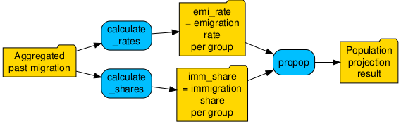

  
```{r, include = FALSE}
knitr::opts_chunk$set(
collapse = TRUE,
comment = "#>"
)
```

```{r setup, message = FALSE, warning=FALSE, echo = FALSE}
library(propop)
```

# Overview

This vignette explains how to use `propop::propop()` to carry out population
projections for multiple regions, particularly for subregions within a larger
spatial unit (e.g., municipalities within a canton). It highlights
**two key challenges** that arise when producing such projections and presents
strategies for addressing them.

<div style="border: 2px solid #007AB8; background: #e3f3ff; color: #000000; padding: 16px 20px; border-radius: 12px; font-weight: 400; font-family: sans-serif; text-align: left; box-shadow: 0 2px 8px rgba(0,0,0,0.08);">
1. Obtain the **required input data** for spatial entities below 
the level of cantons 
(got to [Breaking down projection parameters to subregions](#breaking-down)).   
2. Account for **migration between subregions** 
(go to [Migration between subregions](#between-subregions)).    
</div>

<br>
For more background and general information about the required input data, see 
[this vignette](https://statistik-aargau.github.io/propop/articles/project_single_region.html)).   

# Breaking down projection parameters to subregions {#breaking-down}

Numeric information about demographic processes such as births, migration, or
deaths is an essential prerequisite for population projections. However, in
Switzerland, this information is typically available only for cantons, not for
spatial entities at smaller scales.

Supplying input data for spatial units at the sub-cantonal level (e.g.
municipalities) can be straightforward when the data are expressed as rates
(e.g. mortality rates): the simplest approach is to use the same figures for
the subregions as for the canton, unless those figures are implausible for
theoretical or empirical reasons.  

The task is more demanding, however, if you want to **adjust rates** for
subregions or if you need to downscale input data expressed as 
**"numbers of people"**. To address these challenges, consider the following 
options:

- To adjust the cantonal "number of people" estimates among subregions, check the 
next two subsections.  
- To adjust birth rates, you may find the package 
[`propopbirth`](https://github.com/statistik-aargau/propopbirth) useful.   
- To adjust other rates, the procedure described in section 
[Migration between subregions](#between-subregions) could be useful.  

## Distribution of people according to population size

A very simple approach to allocating canton-wide "number of people" estimates
to subregions is to determine each subregion's population size relative to the
canton's total population and distribute the numbers accordingly. Put simply,
if a municipality represents 10% of the canton's population, it would
proportionally receive 10% of the canton's incoming migrants. The approach
described below is more sophisticated because it uses the spatial units'
shares for each demographic group, but the core idea is the same.

Let us look at a concrete, numerical example. The `spatial_unit` column in the 
data set `ag_population_subregional` (included in the package) contains the 
population of five subregions at the end of 2025. 

```{r data-population} 
# Load package data 
## Population of 5 subregions
data("ag_population_subregional")
## FSO data containing parameters for the entire canton
data("fso_parameters")
```

As a starting point for the **input parameters** we use the FSO parameters
for the entire canton (`fso_parameters`). The first step is to duplicate the 
existing parameters for each of the five subregions. After this step, the rates 
and numbers for the subregions are identical to those for the entire canton.

```{r data-parameters} 
# Duplicate FSO parameters for five subregions
fso_parameters_sub <- fso_parameters |>
  dplyr::filter(scen == "reference") |>
  # duplicating rows 5 times
  tidyr::uncount(5) |>
  # create 5 subregions
  dplyr::mutate(
    spatial_unit = as.character(
      rep(1:5, length.out = dplyr::n())
  ))
```

To calculate the shares for the five subregions, we count the number of people 
in each demographic group across all spatial units (`sum_n`).
Then `share` is obtained by dividing the spatial unit's `n` by the total number 
of people across all spatial units in the respective demographic group (`sum_n`). 

```{r shares-pop-size}
# Calculate shares
df_population_shares <- ag_population_subregional |>
  dplyr::mutate(sum_n = sum(n), .by = c(nat, sex, age)) |>
  dplyr::mutate(share = n / sum_n)

```

<!-- The following example for 29-year old international males shows that the sum of  -->
<!-- all five region's shares is 1. -->

<!-- ```{r show-table-1, message=FALSE, echo = FALSE} -->
<!-- # Display table -->
<!-- df_population_shares |> -->
<!--   dplyr::mutate(share = round(share, 3)) |> -->
<!--   dplyr::arrange(year, age, sex, nat) |>  -->
<!--   dplyr::filter(sex == "m" & nat == "int" & age == "29") |> -->
<!--   dplyr::slice_head(n = 5) |>  -->
<!--   DT::datatable( -->
<!--   rownames = FALSE, -->
<!--   options = list( -->
<!--     dom = "t", -->
<!--     paging = FALSE -->
<!--   )) |> -->
<!--   DT::formatStyle(c("share"), -->
<!--                   backgroundColor = DT::styleRow(c(1:5), "#96D4FF", default = "") -->
<!--   ) -->
<!-- ``` -->

Now all required data are available. We can proceed to distribute the input 
variables expressed as "number of people" among the subregions. 

Let us do this for immigration from other countries (`imm_int_n`) and immigration 
from other cantons (`imm_nat_n`). We first join the data frame containing the 
projection parameters (`fso_parameters_sub`) and the data frame containing the 
shares (`df_population_shares`). The actual distribution involves only a single 
line per parameter, in which the canton-wide numbers of immigrants (`imm_int_n` and 
`imm_nat_n`) is multiplied by the share (`share`), which in this simple approach 
is identical for both types of immigration.

```{r distribute-pop-size}
parameters_sub_size <- fso_parameters_sub |>
  dplyr::left_join(
    df_population_shares |>
      dplyr::select("spatial_unit", "nat", "sex", "age", "share"),
    by = c("spatial_unit", "nat", "sex", "age")
  ) |>
  dplyr::mutate(
    # Calculate number of incoming people per demographic group and spatial unit
    imm_int_n_distr = imm_int_n * share,
    imm_nat_n_distr = imm_nat_n * share
  )
```

Let us take a closer look at the result of this, focusing on immigration from 
other countries. In the table below, we compare `imm_int_n` -- the original 
figures provided by the FSO for the entire canton -- with the sum of the distributed 
parameter `imm_int_n_distr`. The table confirms that the `group_sum` 
<span style="color: #96D4FF;">in the blue column</span>
is equal to the original number of people `imm_int_n` 
<span style="color: #ffcc8f;">in the orange column.</span>

```{r distr-pop-size-group_sum, echo = FALSE}
parameters_sub_size |>
  dplyr::filter(scen == "reference" & year == 2026) |> 
  dplyr::select(year, nat, sex, age, spatial_unit,
                imm_int_n, share, imm_int_n_distr) |> 
  dplyr::mutate(
    group_sum = round(sum(imm_int_n_distr), 0),
    .by = c(year, nat, sex, age)
  ) |>
  dplyr::filter(sex == "m" & nat == "int" & age == "29") |>
  dplyr::mutate(across(c(imm_int_n, share, imm_int_n_distr), 
                       \(x) round(x, 3))) |> 
  dplyr::arrange(year, age, sex, nat) |> 
  dplyr::slice_head(n = 5) |> 
  DT::datatable(
    rownames = FALSE,
    options = list(
      dom = "t",
      paging = FALSE
    )
  ) |>
  DT::formatStyle(
    "imm_int_n",
    backgroundColor = "#ffcc8f"
  ) |>
  DT::formatStyle(
    c("group_sum"),
    backgroundColor = "#96D4FF"
  )
```
\
To proceed with the projection, we rename the columns containing the distributed 
immigration (`imm_int_n_distr` and `imm_nat_n_distr`) to
`imm_int_n` and `imm_nat_n`. Otherwise, `propop()` will not recognise the parameters.  

``` {r cleaning}
parameters_sub_size_clean <- parameters_sub_size |>
  dplyr::mutate(
    # Rename variables
    imm_int_n = imm_int_n_distr,
    imm_nat_n = imm_nat_n_distr
  ) |>
  dplyr::select(-c(share, imm_int_n_distr, imm_nat_n_distr))
```

Now we can run the projection:

```{r project-1}
propop(
  parameters = parameters_sub_size_clean,
  year_first = 2026,
  year_last = 2027,
  scenarios = "reference",
  age_groups = 101,
  fert_first = 16,
  fert_last = 50,
  share_born_female = 100 / 205,
  population = ag_population_subregional,
  binational = TRUE,
  subregional = FALSE
)
```
\ 

## Distribution of people according to past migration {#past-migration}

The second approach to distributing "number of people" estimates among subregions 
uses historical migration records. One advantage of this approach is that it can
differentiate between different types of migration (or any number-of-people 
input) and thereby enables each parameter to be adjusted independently (rather than 
using the same share for adapting all parameters). This is very useful, for example, 
if immigration from other cantons differs from immigration from other countries.
To illustrate this approach, we use package data.   

> You can obtain such data by summarizing historical migration records. 

The data frame includes two columns with historical immigration (2022-2025) 
from abroad (`hist_imm_int_n`) and from other cantons (`hist_imm_nat_n`) to the 
five regions. The table below shows the result for a sample group:

```{r data-historical-immigration, echo = FALSE, message=FALSE}
ag_migration_subregional |>
  dplyr::select(year, spatial_unit, age, nat, sex, hist_imm_nat_n, hist_imm_int_n) |> 
  dplyr::filter(sex == "m" & nat == "int" & age == "29") |>
  dplyr::relocate(year, .before = 1) |> 
  DT::datatable(
    rownames = FALSE,
    options = list(
      dom = "t",
      paging = FALSE
    ))
```

A **challenge** is that records often vary considerably between years. If 
patterns are too uneven, future trends may become erratic, especially in 
groups with few people (e.g., small municipalities or small age groups). 

There are at least three ways to mitigate this issue: 

1. Consider **multiple years** and use an **aggregated measure**, such as the 
arithmetic mean or the median, as an estimate of each demographic group's past 
migration.  

1. Use **larger age groups** (e.g., 5-year or 10-year age groups). Moving from 
1-year age groups to larger age groups increases the number of observations and 
smooths out irregular patterns.       

1. Examine **larger spatial units** (e.g., several municipalities together). This 
is not shown in this vignette.  


`propop::calculate_shares()` makes it easy to implement 1. and 2. To use 
`propop::calculate_shares()`, you need to provide a data frame containing 
`imm_n`, a column with the number of immigrants per demographic group (e.g., 
`hist_imm_int_n`, as calculated above). 


```{r result-historical-immigration, eval = TRUE}
data_distr_hist_int <- ag_migration_subregional |> 
  calculate_shares(
    imm_n = "hist_imm_int_n", 
    age_group = 5,
    year_range = 2022:2025,
    binational = TRUE,
    two_sex = TRUE)
```

Under the hood, `propop::calculate_shares()` computes the 
<span style="color: #96D4FF;">historical sum for the requested demographic group
and years in each spatial unit</span> (`sum_imm_n`) and 
<span style="color: #007AB8;">across all regions</span> (`total_imm_n`).
On this basis,
<span style="color: #005D91;">the proportion of people to be allocated to the respective 
group and spatial unit </span> is calculated (`imm_share = sum_imm_n / total_imm_n`). 

This table shows the result for a sample group in the five subregions:


```{r table-historical-immigration, eval = TRUE, echo = FALSE}
data_distr_hist_int |>
  # Display rounded numbers to save space
  dplyr::mutate(imm_share = round(imm_share, 3)) |>
  dplyr::filter(sex == "m" & nat == "int" & age == "29") |>
  DT::datatable(
    # rownames = FALSE,
    # options = list(
    #   dom = "t",
    #   paging = FALSE
    # )
  ) |>
  DT::formatStyle(
    "sum_imm_n",
    backgroundColor = "#96D4FF"
  ) |>
  DT::formatStyle(
    "total_imm_n",
    backgroundColor = "#007AB8"
  ) |>
  DT::formatStyle(
    "imm_share",
    backgroundColor = "#005D91"
  )
```

<!-- Note that summarizing the shares of a demographic group across all spatial units -->
<!-- always adds up to 1: -->

```{r share-check, eval = TRUE, message = FALSE, echo = FALSE, results='hide'}
# Useful check for development, not shown in final vignette
data_distr_hist_int |>
  dplyr::select(spatial_unit, age_group, nat, sex, imm_share) |>
  dplyr::distinct() |>
  dplyr::summarise(sum_share = round(
    sum(imm_share, na.rm = TRUE),
    digits = 2
  ), .by = c(nat, sex, age_group)) |>
  DT::datatable()
```

\
From now on, the procedure is identical to that used in in the first approach, 
which distributed the number of people according to population size. That is, the 
share is multiplied by the numbers estimated by the FSO for the whole canton. 


```{r parameters-distributed, eval = TRUE}
# Calculate the historical shares for immigration from other cantons
data_distr_hist_nat <- ag_migration_subregional |> 
  calculate_shares(
    imm_n = "hist_imm_nat_n", 
    age_group = 5,
    year_range = 2022:2025,
    binational = TRUE,
    two_sex = TRUE)

# Add both shares to the data frame that holds the parameters for the whole canton
# Start from the original duplicated parameters
fso_parameters_sub_distr_hist <- fso_parameters_sub |>
  dplyr::left_join(
    data_distr_hist_int |>
      dplyr::select(spatial_unit, nat, sex, age, 
                    share_imm_int = imm_share),
    by = dplyr::join_by(spatial_unit, nat, sex, age)
  ) |>
  dplyr::left_join(
    data_distr_hist_nat |>
      dplyr::select(spatial_unit, nat, sex, age, 
                    share_imm_nat = imm_share),
    by = dplyr::join_by(spatial_unit, nat, sex, age)
  ) |>
  # Compute immigration-`n` for subregions
  dplyr::mutate(
    imm_int_n_distr = imm_int_n * share_imm_int,
    imm_nat_n_distr = imm_nat_n * share_imm_nat
  )
  
```

As in the first version, we can inspect the result for the parameter "immigration from other countries". The table compares the figures provided by the FSO for the whole 
canton (`imm_int_n`) with the sum of the distributed parameter `imm_int_n_distr`. 

Using the same sample group as above, it can be seen that `group_sum_int` 
<span style="color: #96D4FF;">in the blue columns</span>
is equal to the original number of people `imm_int_n` 
<span style="color: #ffcc8f;">in the orange columns.</span>


```{r distr-pop-size-group_sum2, echo = FALSE}
fso_parameters_sub_distr_hist |>
  dplyr::select(year, nat, sex, age, spatial_unit,
                imm_int_n, 
                share_imm_int, 
                imm_int_n_distr
  ) |> 
  dplyr::mutate(
    group_sum_int = round(sum(imm_int_n_distr), 0),
    .by = c(year, nat, sex, age)
  ) |>
  dplyr::filter(sex == "m" & nat == "int" & age == "29" & year == 2026) |>
  dplyr::mutate(across(c(
    imm_int_n, share_imm_int, imm_int_n_distr), \(x) round(x, 3)) 
  ) |>
  dplyr::arrange(year, age, sex, nat) |> 
  dplyr::filter(sex == "m" & nat == "int" & age == "29") |>
  dplyr::slice_head(n = 5) |> 
  DT::datatable(
    rownames = FALSE,
    options = list(
      dom = "t",
      paging = FALSE
    )
  ) |>
  DT::formatStyle(
    "imm_int_n",
    backgroundColor = "#ffcc8f"
  ) |>
  DT::formatStyle(
    c("group_sum_int"),
    backgroundColor = "#96D4FF"
  )
```
\

<!-- This also holds for other groups: The difference between the total migration  -->
<!-- in the subregions and the whole canton (input parameter) is always equal to zero. -->

<!-- ```{r sum-check, eval = TRUE, echo = TRUE} -->
<!-- check_sums_subregions <- fso_parameters_sub_distr_hist |> -->
<!--   # add up number of people in different spatial units -->
<!--   dplyr::summarise( -->
<!--     sum_imm_int_sub = round(sum(imm_int_n_distr, na.rm = TRUE), digits = 0), -->
<!--     sum_imm_nat_sub = round(sum(imm_nat_n_distr, na.rm = TRUE), digits = 0), -->
<!--     .by = c(nat, sex, age, year) -->
<!--   ) |> -->
<!--   # join with original input data (for the whole canton) -->
<!--   dplyr::left_join(fso_parameters |>  -->
<!--                      dplyr::filter(scen == "reference"), by = c("nat", "sex", "age", "year")) |> -->
<!--   # calculate difference between immigration at the level of subregions and canton -->
<!--   dplyr::mutate( -->
<!--     diff_int = sum_imm_int_sub - imm_int_n, -->
<!--     diff_nat = sum_imm_nat_sub - imm_nat_n, -->
<!--   ) -->

<!-- # All observed differences are equal to zero -->
<!-- unique(check_sums_subregions$diff_int) -->
<!-- unique(check_sums_subregions$diff_nat) -->
<!-- ``` -->
<!-- \ -->

To proceed with the projection, we rename the columns containing the distributed 
immigration values (`imm_int_n_distr` and `imm_nat_n_distr`) to
`imm_int_n` and `imm_nat_n`. Otherwise, `propop()` will not recognise the parameters.  

``` {r cleaning-2}
fso_parameters_sub_distr_hist <- fso_parameters_sub_distr_hist |>
  dplyr::mutate(
    # Rename variables
    imm_int_n = imm_int_n_distr,
    imm_nat_n = imm_nat_n_distr
  ) |> 
  dplyr::select(-c(imm_int_n_distr, imm_nat_n_distr))
```


Now everything is ready to run the projection: 

```{r project-2, eval = TRUE}
propop(
  parameters = fso_parameters_sub_distr_hist,
  year_first = 2026,
  year_last = 2027,
  scenarios = "reference",
  age_groups = 101,
  fert_first = 16,
  fert_last = 50,
  share_born_female = 100 / 205,
  population = ag_population_subregional,
  binational = TRUE,
  subregional = FALSE
)
```


# Migration between subregions {#between-subregions}

In `propop`, you may account for migration between subregions by specifying this 
in the `propop()` argument `subregional = `. You can choose between two mathematical 
approaches, using either  

- migration *rates* (`subregional = rate`)    
- or migration *net numbers* (`subregional = net`) 

For both approaches, additional columns in the parameter data frame are required. 
We **recommend the rate approach** because the net approach may lead to negative 
numbers of people in very small groups.

The following two sections illustrate how to use the rate and net approaches.


## Subregional migration rates

### Preparation

To use the **rate** method in `propop`, the parameter data frame must include 
emigration and immigration rates:   

- The **emigration rate** (`emi_sub`) is the typical proportion of a chosen
demographic group at a given spatial resolution that moves away from a location 
each year. 
One way to determine this value is to calculate the annual emigration proportion 
for the group in past years and then take the mean of these annual rates.
For example, if in the 2024 two out of ten people moved away and 
in the 2025 three out of ten people moved away, the estimate would be 
(0.2 + 0.3) / 2 = 0.25.  
The function `propop::calculate_rates()` makes it easy to compute `emi_sub`.  
- The **immigration share** (`imm_sub`) represents, for each spatial unit, 
the proportion of all within-region migrants who settle there. This value 
can be calculated using past migration. The level of detail can range from low 
(e.g., one estimate per district for everyone in 10-year age groups) 
to high (e.g., a separate estimate for each age / sex / nationality group in 
every municipality). To implement this step, the function `propop::calculate_shares()`
may be useful.  

The required <span style="color: #ffd700; font-weight:bold;">data</span> and available 
<span style="color: #00bfff; font-weight:bold;">functions</span> 
to implement the rate approach are visualised in the following figure: 


{alt="Using calculate_rate and calculate_shares to process past migration data, which is then used in propop()"}


### Redistribution in detail

When running `propop()`, the rate-based method requires the parameters `emi_sub`
(which corresponds to the more generic `emi_rate` as calculated
in `calculate_rates`) and `imm_sub` (which corresponds to the more generic `imm_share` 
as calculated in `calculate_shares`). Using these parameters, `propop()` reallocates 
individuals each year at the chosen spatial and demographic resolution in three steps: 

1. The number of people who move to another location within the region is computed
based on `emi_sub` and the group's size at the beginning of the year. This is usually 
`n_jan`. However, since the number of newborns is zero at the beginning of the year, 
the number of births per year is used as a basis for this group.   
1. These emigrants are added up across subregions and placed into a "distribution pool".  
1. The people in this pool are then distributed among the subregions according to 
`imm_sub`. 

This procedure is repeated in each year of the projection.   

### Numerical example

To illustrate the rate approach, we start with aggregated past migration records 
(2024–2025) for five regions in the Canton of Aargau. We first use `calculate_rates()` 
to calculate "the rate for each demographic group and year (`emi_rate_year`) and
the mean of these shares over time (`emi_rate`). To make it easy to follow the 
calculation, we aggregate into 2-year age groups and only use two years. 

```{r emi-rate}
data("ag_migration_subregional") 

# Compute mean for each demographic group
emi_rate <- calculate_rates(
  past_migration = ag_migration_subregional,
  year_range = 2024:2025,
  n_jan = n_jan,
  births = births,
  emi_n = hist_emi_sub_n,
  spatial_unit = spatial_unit,
  age_group = 2,
  method = "mean"
) 
```
\ 
The table below shows the average emigration rate (`emi_rate`) 
for 28- and 29-year old international men in the five spatial units (highlighted
in different colours).

```{r emi-rate-table, echo=FALSE}

spatial_units <- unique(emi_rate$spatial_unit)
colors <- colorspace::lighten(
  c("#007AB8", "#ffa81f", "#A05388", "#ffe562", "#96D4FF"),
  amount = 0.8)


emi_rate |> 
  # Select sample group
  dplyr::filter(age >= 28 & age <= 29 & nat == "int" & sex == "m") |> 
  # Remove columns to fit on screen
  dplyr::select(-births, -n_jan, -sex, -nat, -method) |> 
  dplyr::mutate(emi_rate_year = round(emi_rate_year, 3),
                emi_rate = round(emi_rate, 3)
                ) |>
  dplyr::arrange(spatial_unit) |>
   DT::datatable(
  rownames = FALSE,
  options = list(
    dom = "t",
    paging = FALSE
  )) |> 
  DT::formatStyle(
    columns         = "spatial_unit",
    target          = "row",
    backgroundColor = DT::styleEqual(spatial_units, colors)
  ) |> 
    DT::formatStyle(
    columns    = "emi_rate_year",
    fontStyle = "italic"
  ) |> 
  DT::formatStyle(
    columns    = "emi_rate",
    fontWeight = "bold"
  )
```

We then use `calculate_shares()` to compute the proportion of people to be 
allocated to the requested demographic groups and spatial units based on past
migration patterns (see also the section on 
[Distribution according to past migration](#past-migration)).

```{r imm_share}
imm_share <- calculate_shares(
  past_migration = ag_migration_subregional,
  year_range = 2024:2025,
  imm_n = "hist_imm_sub_n",
  age_group = 2
) 
```
\ 
The table below shows the result for the group of 28- and 29- year old international 
men. It includes the number of immigrants for each 2-year age group and spatial 
unit (`sum_imm_n`), the total number of immigrants across all spatial units 
(`total_imm_n`), and the share for each group and spatial unit (`imm_share`). 

```{r imm_share-table, echo=FALSE}
imm_share |> 
  # Select sample group
  dplyr::filter(age >= 28 & age <= 29 & nat == "int" & sex == "m") |> 
  dplyr::distinct(age_group, spatial_unit, .keep_all = TRUE) |> 
  # Remove columns to fit on screen
  dplyr::select(-age, -sex, -nat) |> 
  dplyr::mutate(imm_share = round(imm_share, 3)) |>
  dplyr::arrange(spatial_unit) |>
   DT::datatable(
  rownames = FALSE,
  options = list(
    dom = "t",
    paging = FALSE
  )) |> 
  DT::formatStyle(
    columns         = "spatial_unit",
    target          = "row",
    backgroundColor = DT::styleEqual(spatial_units, colors)
  ) |> 
  DT::formatStyle(
    columns    = "imm_share",
    fontWeight = "bold"
  )
```

Next we add the new parameters as `emi_sub` and `imm_sub` to the data frame that 
contains the parameters (we can re-use `fso_parameters_sub_distr_hist`). 

```{r prep-project-rate, eval = TRUE}
parameters_rate <- fso_parameters_sub_distr_hist |> 
  dplyr::left_join(
    emi_rate |> 
      dplyr::select(spatial_unit, age, nat, sex, emi_rate) |> 
      dplyr::distinct(),
    by = dplyr::join_by(nat, sex, age, spatial_unit),
    relationship = "many-to-many") |> 
  dplyr::left_join(
    imm_share |> 
      dplyr::select(spatial_unit, age, nat, sex, imm_share) |> 
      dplyr::distinct(),
    by = dplyr::join_by(nat, sex, age, spatial_unit),
    relationship = "many-to-many") |> 
  # Use names expected in propop()
  dplyr::rename(emi_sub = emi_rate, imm_sub = imm_share)
```

Then we set `subregional` to `rate` and run `propop::propop()`:


```{r project-rate, eval = TRUE}
propop(
  parameters = parameters_rate,
  year_first = 2026,
  year_last = 2055,
  age_groups = 101,
  fert_first = 16,
  fert_last = 50,
  share_born_female = 100 / 205,
  population = ag_population_subregional,
  binational = TRUE,
  subregional = "rate"
)
```


## Subregional net migration

If you want to use **net migration numbers**, the parameter data frame
must contain the column `mig_sub`. `mig_sub` is the net migration between subregions 
(e.g., municipalities, districts) within the main superordinate projection unit 
(e.g., a canton). `mig_sub` must be provided by the user (e.g., by computing
the median net migration over the past 10 years to capture recent trends and 
carry them forward into the future). 

The data for the example calculation is included in the package (`ag_migration_subregional`).

> To obtain such data, you may summarize population register records as we 
described in the section [Distribution according to past migration](#past-migration)).

First, we use `calculate_shares()` as a *shortcut* to obtain the number of
past emigrants and immigrants. This function provides a convenient way to obtain
the number of migrants for custom age groups and year ranges.

```{r, eval = TRUE}
# Historical subregional immigration
subregional_imm_share <- ag_migration_subregional |> 
  dplyr::select(year, spatial_unit, age, nat, sex, hist_imm_sub_n) |> 
  calculate_shares(
    imm_n = "hist_imm_sub_n", 
    age_group = 5,
    year_range = 2022:2025,
    binational = TRUE,
    two_sex = TRUE
  )

# Historical subregional emigration
subregional_emi_share <- ag_migration_subregional |> 
  dplyr::select(year, spatial_unit, age, nat, sex, hist_emi_sub_n) |>
  calculate_shares(
    imm_n = "hist_emi_sub_n", 
    age_group = 5,
    year_range = 2022:2025,
    binational = TRUE,
    two_sex = TRUE
  )
```

Then, we compute net migration by subtracting the aggregated subregional 
emigration (`hist_emi_sub_n`) from the subregional immigration (`hist_imm_sub_n`).

```{r, eval = TRUE}
subregional_net_migration <- dplyr::full_join(
  subregional_imm_share |> 
    dplyr::select(
      spatial_unit, age, age_group, nat, sex, sum_imm_sub_n = sum_imm_n, 
      total_imm_sub_n = total_imm_n, imm_sub_share = imm_share
    ),
  subregional_emi_share |> 
    dplyr::select(
      spatial_unit, age, age_group, nat, sex, sum_emi_sub_n = sum_imm_n, 
      total_emi_sub_n = total_imm_n, emi_sub_share = imm_share
    ),
  by = dplyr::join_by(spatial_unit, age, age_group, nat, sex)
  ) |> 
  # calculate net migration
  dplyr::mutate(sum_mig_sub_n = sum_imm_sub_n - sum_emi_sub_n) 
```

Since the two values are based on aggregated data, no further aggregation is 
required. We can add `mig_sub` as a column to the parameters:

```{r, eval = TRUE}
parameters_net <- fso_parameters_sub_distr_hist |> 
  dplyr::left_join(
    subregional_net_migration |> 
      dplyr::mutate(mig_sub = sum_mig_sub_n) |> 
      dplyr::select(spatial_unit, age, nat, sex, mig_sub),
    by = dplyr::join_by(spatial_unit, age, nat, sex)
  )
```

All required input files are available, and we can set `subregional` to
`net` and use `propop::propop()`:

```{r project-3, eval = TRUE}
propop(
  parameters = parameters_net,
  year_first = 2026,
  year_last = 2055,
  age_groups = 101,
  fert_first = 16,
  fert_last = 50,
  share_born_female = 100 / 205,
  population = ag_population_subregional,
  binational = TRUE,
  subregional = "net"
) 
```
